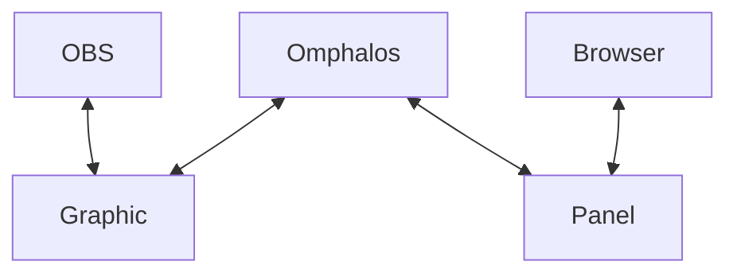

Omphalos is a "Broadcast Graphics Framework and Application"; that description
is taken directly from [NodeCG][1], which is the spiritual successor to this
project. Spiritual in the sense that this is an entirely distinct code base
that is meant to produce a similar application, but with varying features and
in a different way.

The goal of Omphalos is to be your one stop stream control center for streaming
broadcast graphics. While you **CAN** control your stream with it (with an
appropriate extension `bundle`), and although it **CAN** replace a
[StreamDeck][2], the intent is to give you full creative control over the
**CONTENT** that you create.

Omphalos provides a fully customizable way (via web technologies like
JavaScript, HTML, and CSS) to design any graphic or dynamic content that you like,
and gives you full control over what is displayed, and how.

This is perhaps best illustrated with a simple diagram:

In Omphalos you install `bundles` &mdash; little packages of code and web pages
&mdash; and it orchestrates communications between the `extension` code, the
control `panels` the bundle provides, and the `graphics` that are displayed
directly in [OBS][3].

The result is the ability for you to design any dynamic graphic concept you can
imagine, create a simple control panel to control what the graphic displays or
does, and tie it all together with some code that not only controls everything
but can *also* harness the full power of JavaScript to do whatever you want.

:::info Omphalos works with more than just OBS!

Or rather, Omphalos is purely a system that makes it easier to create a
dynamic, fully controllable web page. Any streaming software that has the
ability to source a layer via a web page will work with Omphalos.

Throughout the documentation, `OBS` is used as a shorthand for "your streaming
software of choice", which is a long and clunky sentence.

:::

  [1]: https://www.nodecg.dev/
  [2]: https://www.elgato.com/en/stream-deck-mk2
  [3]: https://obsproject.com/